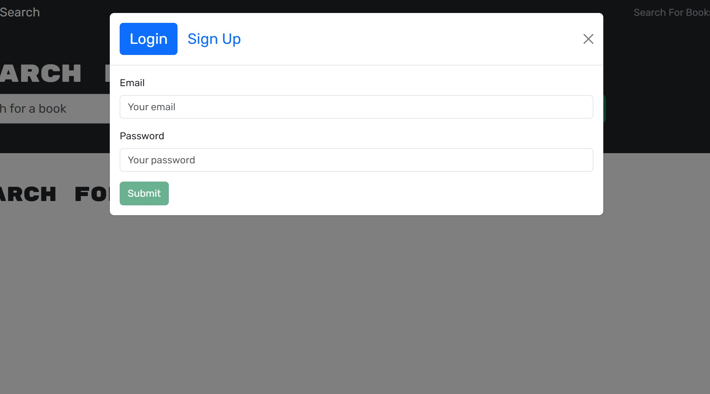
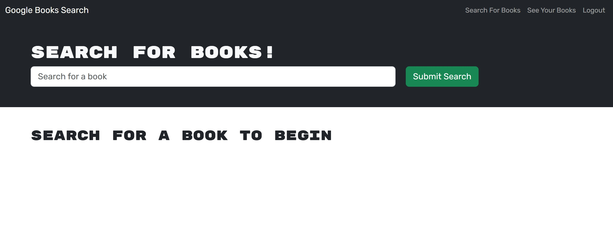
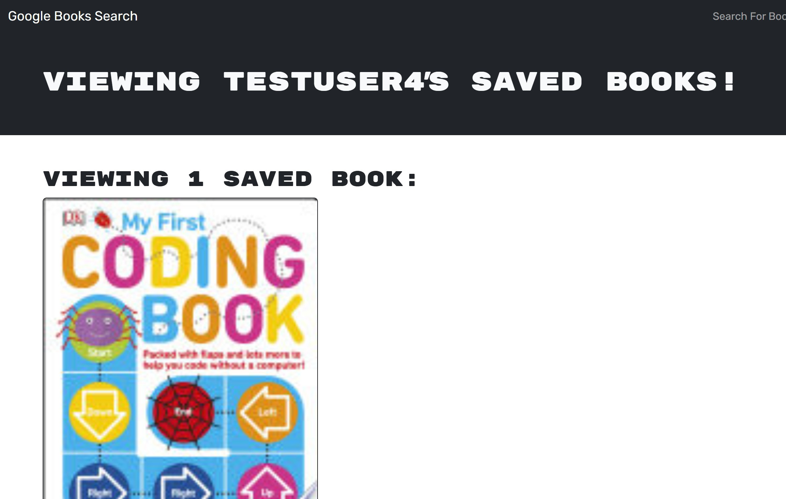

# Book Search Engine

## Table of Contents
- [Description](#description)
- [Screenshots](#screenshots)
- [Installation](#installation)
- [Usage](#usage)
- [License](#license)
- [Contributing](#contributing)
- [Tests](#tests)
- [Credit](#credit)
- [Project Links](#project-links)
- [Questions](#questions)

## Description

A book search engine that allows you to search for books, add them to your saved list and also remove books you no longer want.

## Screenshots

Here are some previews of the web page:

###  Login page

### Book Search page

### Saved Books page

## Installation

1. Go to in your browser.

## Usage

1. Login or Sign Up.

2. 

## License

This application is covered under the MIT license.

## Contributing

If you would like to contribute to my project please follow these steps!

1. Fork the repository on GitHub.
2. Clone your fork to your computer.
3. Create a new branch for your changes.
4. Make your changes and commit them using descriptive messages.
5. Push your branch and open a pull request!

## Tests

1. Ensure Login and Sign Up works.
2. Ensure that you are able to search for a book.
3. When you click on the "Save this book!" button, ensure that the button changes to "This book has already been saved!"
4. When you go to "See Your Books", the books you have selected to save are there.
5. When you choose to delete a book, it removes the book from your saved list.
6. Ensure all buttons work and take you to the correct location.

## Credit

-Tutor Justin Moore helped with the setup and making sure I knew what to start with. 

-ChatGPT helped with adjusting some things to make the GraphQL function. Also, helped with correcting routes and adding in checks to see why my code was breaking.

## Project Links

Repository: https://github.com/taijamartinez/bookSearchEngine   
Render URL: 

## Questions

Please reach me here with additional questions:

GitHub: https://github.com/taijamartinez  
Email: taijasmartinez@gmail.com 

Happy coding! 🚀 
